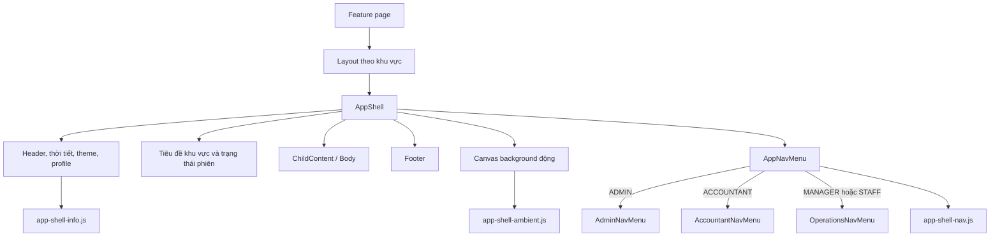

# PropFlow Shared Application Shell

## 1. Mục đích

Tài liệu này mô tả application shell dùng chung của PropFlow gồm:

- header và thông tin người dùng;
- tiêu đề khu vực làm việc;
- background động;
- thời tiết, ngày và giờ;
- footer;
- navigation nổi, có thể kéo và tự đổi menu theo role.

Các trang nghiệp vụ chỉ cung cấp phần nội dung `@Body`. Không tạo lại header, footer, background hoặc navigation riêng trong từng feature.

## 2. Sơ đồ hoạt động



Luồng render thực tế:

1. Page khai báo `@layout` phù hợp và `[Authorize]` cho route.
2. Layout truyền `@Body` vào `AppShell`.
3. `AppShell` render phần giao diện dùng chung và gọi `AppNavMenu`.
4. `AppNavMenu` dùng `AuthorizeView` để chọn menu tương ứng với role hiện tại.
5. Sau lần render đầu tiên, các JavaScript module được import để khởi tạo canvas, thời gian, thời tiết và hành vi kéo nav.
6. Khi component bị hủy, các module phải gỡ timer, animation frame, observer và event listener.

## 3. Cấu trúc file

```text
src/PropFlow.Web.Client/
├── Layout/
│   ├── MainLayout.razor
│   ├── AdminLayout.razor
│   ├── AccountantLayout.razor
│   ├── NavMenu.razor
│   ├── Shared/
│   │   ├── AppShell.razor
│   │   └── AppShell.razor.css
│   └── Navigation/
│       ├── Shared/
│       │   ├── AppNavMenu.razor
│       │   └── AppNavMenu.razor.css
│       ├── Admin/
│       │   ├── AdminNavMenu.razor
│       │   └── AdminNavMenu.razor.css
│       ├── Accountant/
│       │   ├── AccountantNavMenu.razor
│       │   └── AccountantNavMenu.razor.css
│       └── Operations/
│           ├── OperationsNavMenu.razor
│           └── OperationsNavMenu.razor.css
└── wwwroot/js/
    ├── app-shell-ambient.js
    ├── app-shell-info.js
    └── app-shell-nav.js
```

## 4. Layout đang sử dụng shell chung

| Khu vực | Layout | Role/menu được dùng |
|---|---|---|
| Administration | `AdminLayout.razor` | `ADMIN` → `AdminNavMenu` |
| Finance | `AccountantLayout.razor` | `ACCOUNTANT` → `AccountantNavMenu` |
| Facility/Operations | `MainLayout.razor` | `MANAGER`, `STAFF` → `OperationsNavMenu` |

Ba layout trên đều render theo mẫu:

```razor
@inherits LayoutComponentBase
@using PropFlow.Web.Client.Layout.Shared

<AppShell>@Body</AppShell>
```

`MainLayout` hiện còn nạp các asset phục vụ trang Facility. Việc đó không thay đổi nguyên tắc: header, footer, background và nav vẫn do `AppShell` quản lý.

Role `RESIDENT` chưa có menu role riêng trong `AppNavMenu`. Khi triển khai khu vực Resident, phải thêm menu dựa trên route và quyền thật; không thêm link giả.

## 5. Trách nhiệm của từng thành phần

### 5.1. `AppShell.razor`

`AppShell` là component bố cục dùng chung và chịu trách nhiệm:

- hiển thị thương hiệu PropFlow và nhãn role;
- lấy tên, role, email và avatar viết tắt từ `AuthSession`;
- hiển thị nút theme sáng/tối;
- hiển thị thời tiết, ngày và giờ khi `ShowWeatherAndClock` bật;
- hiển thị canvas khi `ShowAmbientBackground` bật;
- render `AppNavMenu`;
- render nội dung trang qua `ChildContent`;
- thực hiện logout qua `AuthSession.LogoutAsync()`;
- dispose các JavaScript module đúng vòng đời component.

Hai tham số hiện có:

| Tham số | Mặc định | Tác dụng |
|---|---:|---|
| `ShowAmbientBackground` | `true` | Bật canvas và nút bật/tắt chuyển động nền |
| `ShowWeatherAndClock` | `true` | Bật thời tiết, ngày và giờ |

Nhãn role, tiêu đề và mô tả khu vực được ánh xạ từ `Session.User.Role` trong `AppShell`. Nếu bổ sung role mới, phải bổ sung cả ba mapping để giao diện không rơi về nhãn chung.

### 5.2. `AppShell.razor.css`

File CSS isolated này quản lý toàn bộ giao diện khung dùng chung:

- design token sáng/tối như `--app-surface`, `--app-text`, `--app-muted`, `--app-line`, `--app-accent`;
- header, profile, thời tiết, đồng hồ và tiêu đề khu vực;
- aurora và lớp canvas;
- vùng body và footer;
- chuyển theme có animation;
- responsive mobile;
- trạng thái phiên đang hoạt động.

Quy ước khi sửa CSS shell:

- dùng `rem`, `%`, `min()`, `max()` hoặc `clamp()` cho kích thước cấu trúc chính;
- giữ `box-sizing: border-box` nhất quán;
- chỉ đặt chiều cao viewport ở container gốc;
- dùng token màu thay vì hard-code lại màu cho từng role;
- kiểm tra cả light/dark và zoom từ 50% đến 150%;
- không đặt CSS nghiệp vụ của một feature vào file này.

### 5.3. `AppNavMenu.razor`

Đây là host navigation dùng chung. Component không chứa route nghiệp vụ trực tiếp mà chọn menu theo role:

```razor
<AuthorizeView Roles="ADMIN"><AdminNavMenu /></AuthorizeView>
<AuthorizeView Roles="ACCOUNTANT"><AccountantNavMenu /></AuthorizeView>
<AuthorizeView Roles="MANAGER,STAFF"><OperationsNavMenu /></AuthorizeView>
```

Host cũng chứa drag handle và gọi `app-shell-nav.js`. Vì vậy mọi role nhận cùng hành vi:

- kéo nav tự do trong lúc giữ chuột;
- khi thả, nav tự neo vào mép trái hoặc phải gần nhất;
- điều khiển bằng phím mũi tên khi drag handle được focus;
- giữ nav trong viewport khi cửa sổ thay đổi kích thước;
- lưu vị trí trong `sessionStorage`.

### 5.4. Menu theo role

Các menu role chỉ chịu trách nhiệm khai báo:

- `NavLink` tới route thật;
- icon, `title` và `aria-label`;
- `NavLinkMatch` để hiển thị active state đúng;
- `AuthorizeView` hoặc policy tương ứng khi route có yêu cầu quyền riêng.

Route hiện tại:

| Menu | Route |
|---|---|
| Admin dashboard | `/admin/dashboard` |
| Finance dashboard | `/finance/dashboard` |
| Chờ xác minh thanh toán | `/finance/payments/pending` |
| Hóa đơn chưa thu | `/finance/invoices/unpaid` |
| Nợ quá hạn | `/finance/payments/overdue` |
| Khoản thu đã xác nhận | `/finance/payments/confirmed` |
| Hồ sơ tòa nhà | `/buildings` |
| Cơ sở vật chất | `/facilities` |
| Hồ sơ thiết bị | `/equipment` |

Không dùng `href="#"`. Chỉ thêm nav item sau khi route đích đã tồn tại và có authorization tương ứng.

## 6. JavaScript dùng chung

### 6.1. `app-shell-ambient.js`

Module này vẽ background bằng Canvas 2D:

- số lượng particle thay đổi theo diện tích viewport;
- giới hạn device pixel ratio để giữ độ nét nhưng tránh chi phí render quá cao;
- particle chuyển động bằng `requestAnimationFrame`;
- các particle gần nhau được nối bằng đường có alpha phụ thuộc khoảng cách;
- particle trong vùng ảnh hưởng của con trỏ được hút về phía con trỏ;
- ở khoảng cách rất gần có lực đẩy nhẹ để tránh tất cả chồng thành một điểm;
- màu canvas thay đổi theo class `app-shell-dark`;
- trạng thái bật/tắt được lưu bằng key `propflow-app-ambient-motion` trong `localStorage`;
- animation dừng khi tab bị ẩn và tiếp tục khi tab hoạt động lại.

`initialize(canvas, toggle)` trả về một handle có `dispose()`. Mọi event listener, observer và animation frame phải được dọn trong `dispose()`.

Khi sửa module ES này, nên đổi query version tại chỗ import trong `AppShell.razor`, ví dụ:

```csharp
await JS.InvokeAsync<IJSObjectReference>(
    "import",
    "./js/app-shell-ambient.js?v=20260919-2");
```

Việc đổi version giúp trình duyệt không tiếp tục dùng module cũ trong cache.

### 6.2. `app-shell-info.js`

Module này quản lý:

- ngày và giờ theo timezone `Asia/Ho_Chi_Minh`;
- định dạng ngày bằng locale `vi-VN`;
- thời tiết Thành phố Hồ Chí Minh từ Open-Meteo;
- fallback “Thời tiết chưa có” khi request thất bại;
- cập nhật đồng hồ mỗi 15 giây;
- cập nhật thời tiết mỗi 20 phút;
- hủy request và timer trong `dispose()`.

Thời tiết là thông tin trang trí. Không dùng dữ liệu này cho nghiệp vụ vận hành hoặc quyết định an toàn.

### 6.3. `app-shell-nav.js`

Module này điều khiển nav nổi:

- key lưu vị trí: `propflow-app-nav-position`;
- storage: `sessionStorage`, nên vị trí tồn tại trong phiên tab hiện tại;
- hỗ trợ Pointer Events và pointer capture;
- snap về mép gần nhất sau khi thả;
- dùng `ResizeObserver` và sự kiện `resize` để nav không rơi ra ngoài viewport;
- hỗ trợ phím mũi tên trên drag handle;
- dọn toàn bộ listener và observer trong `dispose()`.

Không sao chép logic kéo nav sang từng menu role.

## 7. CSS isolation và `::deep`

CSS của Blazor được scope theo component. `AppNavMenu.razor.css` cần style các phần tử nằm trong component menu con, vì vậy sử dụng `::deep`, ví dụ:

```css
.app-floating-nav ::deep .admin-nav-link { /* ... */ }
.app-floating-nav ::deep .rail-link { /* ... */ }
.app-floating-nav ::deep .operations-link { /* ... */ }
```

Quy tắc phân chia:

- hình dạng và vị trí của khung nav nổi: `Navigation/Shared/AppNavMenu.razor.css`;
- cấu trúc riêng của từng menu role: file `.razor.css` cạnh menu đó;
- header, footer, background và vùng body: `Shared/AppShell.razor.css`;
- giao diện nghiệp vụ: CSS cạnh page/component của feature.

## 8. Cách dùng shell cho page mới

Một page Finance:

```razor
@page "/finance/example"
@layout PropFlow.Web.Client.Layout.AccountantLayout
@using Microsoft.AspNetCore.Authorization
@attribute [Authorize(Roles = "ACCOUNTANT")]
```

Một page Administration:

```razor
@page "/admin/example"
@layout PropFlow.Web.Client.Layout.AdminLayout
@using Microsoft.AspNetCore.Authorization
@attribute [Authorize(Roles = "ADMIN")]
```

Một page Operations:

```razor
@page "/operations/example"
@layout PropFlow.Web.Client.Layout.MainLayout
@using Microsoft.AspNetCore.Authorization
@attribute [Authorize(Roles = "MANAGER")]
```

Sau đó thêm `NavLink` vào menu role phù hợp nếu page cần xuất hiện trong navigation.

`AuthorizeView` chỉ điều khiển khả năng nhìn thấy menu. Route vẫn phải có `[Authorize]` với role hoặc policy đúng; ẩn link không phải là biện pháp bảo mật route.

## 9. Cách bổ sung role/menu mới

1. Xác nhận role, route và policy đã có trong contract.
2. Tạo `{Role}NavMenu.razor` và `.razor.css` trong `Layout/Navigation/{Role}/`.
3. Chỉ dùng `NavLink` tới route thật.
4. Thêm `AuthorizeView` cho role vào `AppNavMenu.razor`.
5. Bổ sung `RoleLabel`, `SectionHeading` và `SectionDescription` trong `AppShell.razor`.
6. Dùng layout hiện có nếu cấu trúc shell giống nhau; chỉ tạo layout role mới khi cần asset hoặc composition thực sự khác.
7. Kiểm tra active state, quyền truy cập, keyboard focus, mobile và zoom.

Không tạo bản sao `AppShell`, background JavaScript, header hoặc nav chỉ để đổi tên role.

## 10. Những việc không nên làm

- Không viết header/footer riêng bên trong feature page.
- Không khởi tạo thêm canvas background trong page.
- Không tạo `AppShell2`, `AdminShell`, `AccountantShell` hoặc biến thể trùng logic.
- Không hard-code tên, email hoặc avatar người dùng; lấy từ `AuthSession`.
- Không gọi logout trực tiếp bằng JavaScript; dùng flow trong `AuthSession`.
- Không chèn route chưa tồn tại hoặc `href="#"` vào menu.
- Không dựa vào việc ẩn nav để bảo vệ page.
- Không thêm thư viện animation chỉ để thay thế hiệu ứng canvas hiện tại.
- Không quên `dispose()` khi thêm timer, observer hoặc DOM event mới.
- Không sửa CSS shell để giải quyết một chi tiết chỉ thuộc một feature.

## 11. Checklist kiểm tra sau khi sửa shell

### Giao diện

- Light và dark theme chuyển mượt, chữ vẫn đủ tương phản.
- Header, dòng tiêu đề, body và nav giữ đúng tỷ lệ ở zoom 50%, 75%, 100%, 125% và 150%.
- Desktop, tablet và mobile không xuất hiện horizontal overflow ngoài ý muốn.
- Background nằm sau nội dung và không chặn click (`pointer-events: none`).
- Nav luôn nằm trong viewport.

### Navigation và quyền

- Đăng nhập ADMIN chỉ thấy menu Admin.
- Đăng nhập ACCOUNTANT chỉ thấy menu Finance.
- Đăng nhập MANAGER/STAFF thấy menu Operations theo quyền route thực tế.
- Active state đúng với route hiện tại.
- Tab, focus và phím mũi tên hoạt động trên drag handle.
- Truy cập trực tiếp route trái quyền bị chặn dù nav item đã được ẩn.

### JavaScript

- Particle tự chuyển động và phản ứng với con trỏ.
- Nút chuyển động cập nhật `aria-pressed` và giữ lựa chọn sau khi tải lại.
- Đồng hồ tiếp tục cập nhật.
- Weather API thất bại không làm hỏng shell.
- Chuyển trang nhiều lần không tạo timer hoặc event listener trùng.
- Không có lỗi JavaScript trong DevTools Console.

### Build

```powershell
dotnet build .\src\PropFlow.Web.Client\PropFlow.Web.Client.csproj --no-restore
```

## 12. Xử lý sự cố thường gặp

### Sửa JavaScript nhưng giao diện không thay đổi

1. Đổi query version của module import.
2. Dừng Web bằng `Ctrl+C`.
3. Chạy lại:

```powershell
dotnet run --project .\src\PropFlow.Web\PropFlow.Web.csproj --launch-profile https
```

4. Nhấn `Ctrl+F5` trong trình duyệt.

### Particle xuất hiện nhưng đứng yên

Kiểm tra nút chuyển động. Nếu tooltip là “Bật chuyển động nền”, người dùng đã lưu trạng thái `off` trong `localStorage`; bấm nút một lần để bật lại.

Có thể kiểm tra key trong DevTools:

```javascript
localStorage.getItem("propflow-app-ambient-motion")
```

### Nav quay về vị trí cũ

Vị trí nav được lưu trong `sessionStorage`. Xóa key sau nếu cần reset:

```javascript
sessionStorage.removeItem("propflow-app-nav-position")
```

### CSS menu con không áp dụng

Kiểm tra CSS isolation và selector `::deep` trong `AppNavMenu.razor.css`. CSS của host không tự xuyên qua scope của component con nếu thiếu `::deep`.

## 13. Ownership ngắn gọn

| Muốn thay đổi | File chính |
|---|---|
| Header, profile, theme, body slot, footer | `Layout/Shared/AppShell.razor` |
| Giao diện header/footer/background/body | `Layout/Shared/AppShell.razor.css` |
| Chọn menu theo role và drag handle | `Layout/Navigation/Shared/AppNavMenu.razor` |
| Khung nav nổi và style chung của icon | `Layout/Navigation/Shared/AppNavMenu.razor.css` |
| Route/icon của một role | `{Role}NavMenu.razor` |
| Style riêng của menu role | `{Role}NavMenu.razor.css` |
| Particle và tương tác con trỏ | `wwwroot/js/app-shell-ambient.js` |
| Thời tiết, ngày và giờ | `wwwroot/js/app-shell-info.js` |
| Kéo, snap và lưu vị trí nav | `wwwroot/js/app-shell-nav.js` |

Mục tiêu của cấu trúc này là để mọi role dùng chung một khung giao diện và một bộ hành vi, trong khi route và icon nghiệp vụ vẫn được tách rõ theo role.
